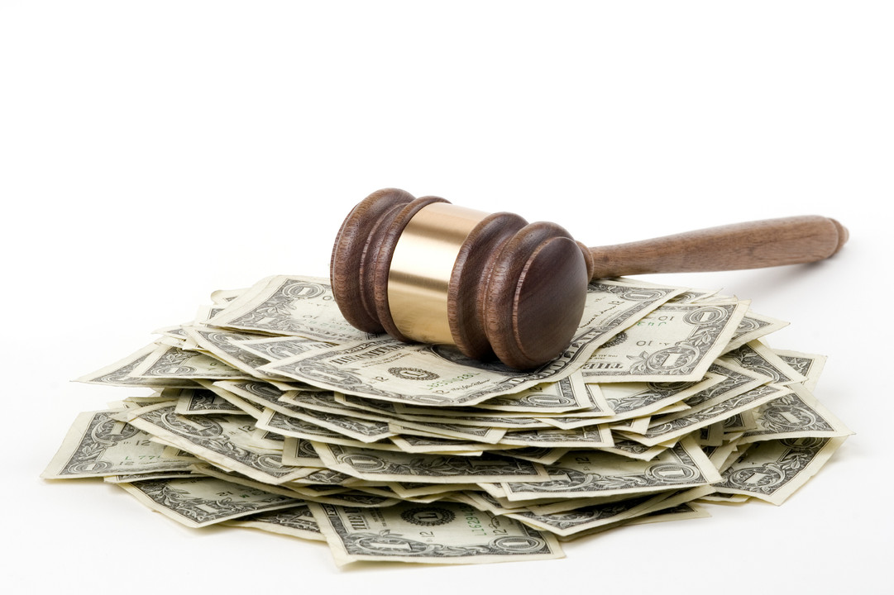

> Article d'origine: https://www.linkedin.com/pulse/avec-la-loi-lemaire-responsabilit%C3%A9-de-ladministration-michael-benesty

Le projet de loi pour une République Numérique (dit loi Lemaire) prévoit qu’en plus de la pseudo-anonymisation, le risque de réidentification devra être analysé par les juridictions pour chaque décision.

Pour rappel, la pseudo-anonymisation consiste à remplacer les noms des personnes physiques par des pseudo (ex. : M. X), et le risque de réidentification est celui qui découle de la possibilité de retrouver le nom qui se cache derrière le pseudo en utilisant les autres informations incluses dans la décision, telle que les faits.

À ce jour, la pseudo-anonymisation des décisions est appliquée du fait d’une simple délibération portant recommandation de la CNIL datée de 2001. La Dila (l’organisme public notamment derrière Légifrance) s’y est conformé pour les décisions dont elle s'occupe et a introduit une obligation de non-réidentification dans sa licence de diffusion des décisions open data.

Ainsi, à ce jour, l'obligation de pseudo-anonymiser les décisions repose uniquement sur de la soft law et il nous semble que cette situation convient à tous les acteurs du monde juridique.

1/ Une nouvelle obligation de moyens à la charge de l’administration

Une des conséquences de la loi à venir qui, à notre connaissance, n’a pas fait l'objet de discussion publique, concerne la responsabilité de l’administration.

Les deux articles du projet de loi relatifs à l’ouverture des décisions précisent que “ces jugements sont mis à la disposition du public à titre gratuit dans le respect de la vie privée des personnes concernées”.

Il ne fait pas de doute que le débiteur de la nouvelle obligation est l'administration, seule à même de mettre gratuitement à la disposition du public les décisions de justice.

Le champ d’application de la mesure est limité aux personnes concernées. Par personnes concernées, il faut comprendre personnes physiques citées dans la décision puisque les personnes morales n’ont pas de vie privée (pour ceux qui en douteraient, cf. Cass, Civ 1, 17 mars 2016) .

On pourrait s’interroger sur la qualification de l’obligation de respect de la vie privée. Il nous semble que l’objectif recherché est large et relativement aléatoire, car il doit s'apprécier au regard de ce que feront les tiers de ces décisions, des possibilités futures de croisement d'information, etc. Il nous semble qu’il s’agit d’une obligation de moyens. La qualification en obligation de résultat ne changerait que peu notre analyse et ses conséquences.

Dans le cadre d’une obligation de moyens, il n’y a faute que si le débiteur n’a pas mis tous les moyens en oeuvre pour atteindre le résultat attendu.

Au regard de la recommandation de la CNIL et du projet de loi Lemaire, le respect de la vie privée semble pouvoir être atteint par les moyens suivants :

la pseudo-anonymisation ; l'analyse du risque de réidentification (nous en reparlerons). La réforme va transformer une simple recommandation de pseudo-anonymiser en une obligation légale de respect de la vie privée qui ne semble connaître ni exception ni limite.

Or, la responsabilité de l’administration peut être engagée lorsqu’il y a une faute, un préjudice et un lien de causalité.

Les exceptions traditionnelles à ce mécanisme (cas de force majeure, fait de la victime, etc.) ne nous semblent pas avoir vocation à s’appliquer dans ce contexte.

2/ Sur la survenance d’une faute de l’administration

Ce sera certainement une faute (lourde ?) de diffuser des décisions pseudo-anonymisées quand la loi impose à ce que cela soit fait dans le respect de la vie privée et que par ailleurs, il est su à l’avance que la technique employée laisse plusieurs dizaines voire centaines de milliers de décisions imparfaitement pseudo-anonymisées (sans parler du risque de réidentification), chacune des décisions étant susceptible de concerner plusieurs personnes physiques.

L’État sera donc susceptible d’engager sa responsabilité à chaque fois qu’une décision ne sera pas parfaitement pseudo-anonymisée.

Au sujet des décisions futures, si les tribunaux et cours décident de s’équiper de logiciels qui leur permettent d’anonymiser les décisions au moment de leur rédaction (déjà évoqué ici), le risque de survenance sera quasiment inexistant et l’on ne pourra plus parler de faute de l’administration (puisque des moyens adéquats auront été mis en oeuvre).

Concernant les décisions anciennes, on fait référence essentiellement à deux bases déjà constituées et non distribuées en open data :

Jurica : 100% des décisions des cours d’appel  de l’ordre judiciaire depuis 2007 ; Ariane : 100% des décisions du fonds de l’ordre administratif (1er et 2nd degré).

Les décisions de ces deux bases représentent des millions de textes (un peu près 1,5 million uniquement pour Jurica).

Sur les taux de réussite de la pseudo-anonymisation, nous renvoyons le lecteur à deux articles précédents (au sujet des systèmes rule based, et au sujet des systèmes à base de machine learning), nous dirons simplement qu’il est extrêmement difficile d’avoir plus de 90% des décisions parfaitement pseudo-anonymisées, sauf à employer des moyens humains très importants pour la relecture.

Nous n'essaierons pas de quantifier le risque de réidentification, qui ne fait de toutes les façons qu’aggraver les choses.

De ce fait, on peut considérer que l’administration, en cas d’ouverture des bases Jurica et Ariane (pour les décisions déjà existantes), commette autant de fautes qu’il y aura de décisions imparfaitement pseudo-anonymisées.

3/ Sur l’existence d’un préjudice pour atteinte à la vie privée

Il nous semble qu’il existe des domaines où le risque de créer un préjudice à une personne physique du fait d’une anonymisation imparfaite est particulièrement élevé. Il s’agit notamment des décisions dont l’objet du dispositif est d’affecter directement la situation d’une personne physique, certains de ses droits, etc.

Que se passera-t-il  quand une décision de divorce qui donne le nom d’une maîtresse ou qui décrit une lutte entre deux frères pour récupérer l’héritage des parents ne seront pas parfaitement pseudo-anonymisées ?

Les décisions de justice rapportent rarement des faits que demandeurs et défendeurs souhaitent voir diffusés. Par ailleurs, les informations qui y sont contenues sont parfois très personnelles. C’est par exemple le cas, en droit administratif, de la fiscalité personnelle (vous avez dit assiette de l’ISF ?).

La diffusion de telles informations privées est susceptible :

de créer directement un préjudice moral ; d’influencer l’action d’un tiers, et indirectement produire des effets sur la situation d’une des personnes concernées par la décision mal anonymisée.

D’autres décisions semblent présenter moins de risques, telles que celles qui portent sur des litiges commerciaux. Pour autant, les situations réelles sont souvent complexes, et une décision de droit commercial peut être liée à un divorce, etc.

Dans la mesure où il semble délicat de fournir des critères simples pour distinguer les décisions à risque des autres, la règle pourrait être une appréciation du risque au cas par cas.

4/ Sur la vraie nature du risque de réidentification

Le législateur, en plus d’introduire une obligation d’anonymisation (supposée parfaite) dans la loi au travers du respect de la vie privée, crée le risque de réidentification.

Ce risque est aussi attaché à la qualité de l’anonymisation. Au-delà de la pseudo anonymisation, le législateur souhaite s’assurer que même dans le cas où cette dernière est parfaite, elle ne pourra pas être contournée facilement par l’analyse des faits.

On comprend l’intention. Dans le fond, l’idée est très similaire à celle exprimée précédemment. Il s’agit encore de qualité d’anonymisation.

Si dans le précédent paragraphe, nous étions intéressés par les possibles erreurs dans la pseudo-anonymisation, dans le cas présent, il s’agit de se demander si elle est d'une qualité suffisante pour ne pas être contournée par l’analyse des faits.

Il n’est pas clair dans les textes si cette obligation s’applique aux décisions existantes (ex. : Jurica, Ariane) ou uniquement aux décisions futures.

Nous rappelons que les décisions anciennes n’ont pas fait l’objet d’une diffusion publique.

Elles ne sont actuellement disponibles que sur des portails payants auxquels seuls certains professionnels du droit ont accès. À ce jour, cette difficulté d'accès du grand public à ces décisions a permis de limiter effectivement le risque de préjudice du fait d'une pseudo-anonymisation possiblement imparfaite.

Il nous semble que le fait générateur de l'obligation d’anonymisation est nécessairement la diffusion, puisque l’on ne va pas anonymiser des décisions non diffusées (ex. : décisions en matière pénale).

Nous en concluons donc que cette obligation devrait être appliquée à toutes les décisions anciennes que les cours souhaitent diffuser dans le futur, y compris les décisions déjà rendues à ce jour.

Par ailleurs, la quantité des décisions dans les bases existantes et la nature des décisions (du fonds) posent un risque réel rendant l’anonymisation particulièrement nécessaire.

5/ Une hiérarchie des qualités d’anonymisation

Dans les précédents paragraphes, nous avons évoqué la qualité de la pseudo-anonymisation entièrement automatique, puis des cas où celle-ci devait être aussi parfaite que possible et enfin des cas où l’on devait vérifier que les éléments du contexte (par exemple les faits) ne fragilisent pas cette pseudo-anonymisation.

Il nous semble qu’il s’agit en fait de 3 degrés de qualité d’anonymisation :

la pseudo-anonymisation par procédé complètement automatisé ; la pseudo-anonymisation par procédé complètement automatisé suivi d'une vérification manuelle ; la pseudo-anonymisation par procédé complètement automatisé suivi d'une vérification manuelle et d'une analyse du risque de réidentification.

La qualité exigée et les moyens associés à l’anonymisation devrait dépendre de la sensibilité des données qui y sont contenues dans la mesure où une qualité parfaite pour toutes les décisions n’est pas accessible avec des procédés automatiques.

6/ Comment traiter massivement les décisions existantes avec un budget limité ?

Dans la mesure où la qualité de l’anonymisation dépend de son contenu, nous pourrions penser qu’il faudrait que des opérateurs humains parcourent toutes les décisions pour les classer en fonction de leur sensibilité.

Une solution plus économique nous semble envisageable.

Un acteur, tel que la CNIL, pourrait dresser une liste des types de décisions dont le contenu est sensible (ex. : décisions contenant des données de santé, courantes en matières de responsabilité hospitalière). Cette cartographie pourrait être établie sur la base de travaux menés par d’autres acteurs, comme la Dila, voire par une association comme Open Law (qui garantit la multiplicité des points de vues, utile pour la tâche à mener).

Sur la base de cette nomenclature, des jeux de décisions de chaque type pourraient être facilement constitués. Enfin, des algorithmes de machine learning pourraient être employés pour appliquer cette classification à l’ensemble des décisions des bases Jurica et Ariane (notamment).

Il est intéressant de noter que ce type de tâche (classification) est très bien gérée par les algorithmes représentant l’état de l’art en machine learning. Par exemple, pour le projet Supralegem.fr, nous avons appliqué avec succès cette technique pour classer 250 000 décisions administratives dans 71 catégories avec une grande exactitude.

Seules les décisions les plus sensibles seront vérifiées manuellement et feront aussi l’objet d’une analyse du risque de réidentification.

La voie proposée permettrait de mitiger les risques de préjudice pour les personnes physiques et le risque financier pour l’administration (et indirectement le contribuable).

Par cette approche, l'administration montrerait qu'elle a mis en oeuvre tous les moyens à sa disposition (au regard de l'état de l'art en machine learning) pour réaliser son obligation de respect de la vie privée.

Par ailleurs, le coût de l’opération serait contenu, et pourrait même être partiellement supporté par la communauté du droit dans le cadre d’une opération impliquant différents acteurs privés et publics.

Enfin, il serait envisageable que dans ces conditions, les cours suprêmes puissent distribuer les décisions déjà existantes issues des bases Ariane et Jurica via un site entièrement gratuit et accessible à tous comme Légifrance.

Il nous semble que tout cela serait plus simple à mettre en oeuvre si la CNIL conserve une certaine liberté d'appréciation des risques. Pour cela, il faudrait lui déléguer les pouvoirs adéquats en la matière plutôt que d’introduire une obligation générique très forte qui ne connaît pas d’exception et qui serait, de ce fait, extrêmement contraignante à mettre en oeuvre pour tous les acteurs.

Nota bene : l'article a été amendé à 15/09/16 - 13:00 pour corriger une coquille.
