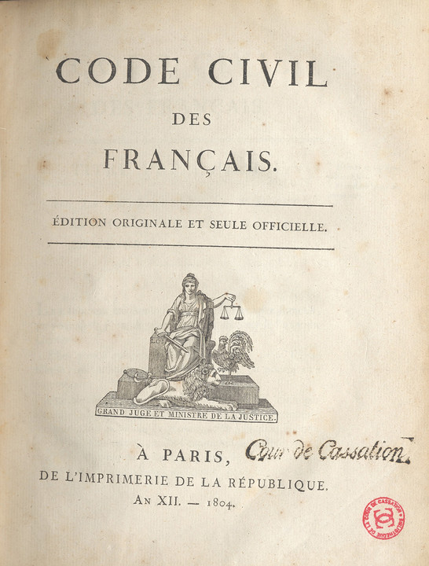

> Article d'origine: https://www.linkedin.com/pulse/est-il-pertinent-de-calculer-des-profils-juges-dans-un-benesty

Suite à la publication de notre article traitant de l’impartialité des juges administratifs en matière d’obligation de quitter le territoire, de nombreuses questions ont été soulevées, notamment sur les réseaux sociaux et par e-mail. Nous souhaitons les présenter une à une et y apporter notre réponse. Chaque article traitera d’un point particulier.

1/ L’intuition

L’article 5 du Code civil dipose qu’ “il est défendu aux juges de prononcer par voie de disposition générale et réglementaire sur les causes qui leur sont soumises”.

Puisque les juges ne peuvent créer de règles de droit, toutes les décisions ne seraient que des cas d’éspèces. Faire des profils de juges ou de cours ne serait alors pas pertinent.

2/ Notre réponse

C'est un fait que la France est de culture civiliste et place la loi au-dessus de la jurisprudence. Il existe cependant des marges d'appréciation de ces règles souvent complexes et dont la cohérence générale est impossible à assurer.

C'est d'ailleurs à cause de ces divergences que les tribunaux et cours existent. Ces derniers n'ont pas toujours la même opinion sur une même question de droit. Il est pudiquement fait référence à la politique jurisprudentielle de la cour, voire de la chambre/section. Nos institutions n'ignorent pas cette difficulté, c'est le rôle des cours suprêmes, qui ont la particularité d'être uniques dans chacun des deux ordres, d'harmoniser les grands principes. Même après cette uniformisation, il reste encore une certaine marge d'appréciation des faits et des règles mineures.

C’est cette approche pragmatique du système juridique qui est inculqué en Fac de droit. Dans la pratique quotidienne d’un avocat, c’est très souvent dans l’étude de la jurisprudence qu’il trouve l’interprétation des lois et décrets dont les textes sont parfois imprécis.

Lorsque la matière est contentieuse, il est souvent pertinent d’étudier la jurisprudence de la chambre qui va trancher le litige, souvent révélatrice de l'importance qu'elle peut donner à certains éléments du dossier. Par exemple, la place accordée à la réglementation comptable dans l'interprétation d'une règle fiscale varie grandement en fonction des magistrats et de leur expérience.

Pour toute ces raison, nous pensons que la création de profils par chambre de Cours d’appel a du sens, même dans un pays de tradition civiliste.
