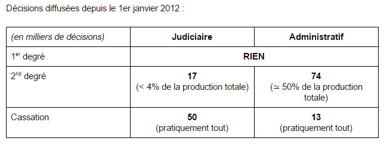

> Article d'origine: https://www.linkedin.com/pulse/mise-au-point-sur-lopen-data-des-d%C3%A9cisions-de-justice-michael-benesty

Le projet de Loi pour une République Numérique est susceptible d’entraîner la mise en open data de la quasi-totalité des décisions des juges du fond. Cette révolution annoncée n’est cependant pas absolue.

1/ Etat des lieux de l’open data des décisions de justice

À ce jour, seule une partie des décisions de justice française est publiquement distribuée. On peut y accéder :

via un moteur de recherche, Légifrance ; via la distribution de fichiers, chacun contenant une décision de justice (utile notamment pour les startup du droit, comme supralegem.fr).

Il existe un déséquilibre important entre les ordres administratif et judiciaire lorsque l’on s’intéresse aux décisions des juges du fond.

Le citoyen n’a pratiquement pas accès aux décisions du fond en judiciaire.

Cela pose un vrai problème de transparence de nos institutions.

La raison de cette quasi-absence de décision au fond dans l’ordre judiciaire vient de la pratique de cet ordre à les revendre à certains grands acteurs du monde du droit.

2/ L’irruption de l’open data juridique dans le projet de loi pour une République Numérique

La question ​de l’open data juridique ​a été introduite ​dans le projet de Loi pour une République Numérique ​le 25 avril au Sénat, par le vote de deux amendements portés par le gouvernement (un pour chaque ordre).

Pour l’administratif (le texte pour le judiciaire est similaire) :

Ces jugements sont mis à la disposition du public à titre gratuit dans le respect de la vie privée des personnes concernées. Les articles L. 321–1 à L. 326–1 du code des relations entre le public et l’administration sont également applicables à la réutilisation des informations publiques figurant dans ces jugements. Les conditions d’application du présent article sont déterminées par décret.

(cf. judiciaire : http://www.senat.fr/amendements/2015-2016/535/Amdt\_582.html et administratif : http://www.senat.fr/amendements/2015-2016/535/Amdt\_581.html)

Ce texte très générique traduit la volonté du gouvernement d’ouvrir ces données.

La position du barreau de Paris est très claire, et il est pour l’open data.

3/ Le coup d’arrêt à l’ouverture des données

11 jours plus tard, les amendements ont été modifiés par les sénateurs :

Lorsqu’ils sont devenus définitifs, ces jugements sont mis à la disposition du public à titre gratuit dans le respect de la vie privée des personnes concernées. Cette mise à disposition du public est précédée d’une analyse du risque de ré-identification des personnes. Les articles L. 321–1 à L. 326–1 du code des relations entre le public et l’administration sont également applicables à la réutilisation des informations publiques figurant dans ces jugements. Un décret en Conseil d’État fixe, pour les jugements de premier ressort, d’appel ou de cassation, les conditions d’application du présent article.

​(cf. judiciaire : http://www.senat.fr/enseance/2015-2016/535/Amdt\_660.html, administratif : http://www.senat.fr/enseance/2015-2016/535/Amdt\_659.html)​

Les modifications introduisent deux points :

​l’analyse préalable du risque de réidentification ; la non-diffusion des décisions tant qu’elle ne sont pas définitives (appel / pourvoit).

Le risque de ré-identification, c’est le risque qu’après anonymisation, il soit possible de retrouver les noms retirés en s’intéressant aux autres éléments du texte. Par exemple, si une décision comporte, “M. X, président du conseil d’administration de la société Carrefour SA en 2012”, il est facile de retrouver l’identité de M. X via une recherche sur internet.

L’audit du risque de ré-identification pour chaque décision a été très critiqué car il ajoute un travail important aux juridictions dont on connaît les moyens déjà en inadéquation face à leurs missions existantes.

Il est intéressant de constater qu’aucune de ces deux contraintes n’existe aujourd’hui et que ce serait une loi supposée pro open data qui les introduirait…

Les deux forces en opposition sont :

Une ouverture des données qui permet une meilleure transparence de la République et une plus grande confiance du citoyen dans ses institutions ; La protection de la vie privée des individus.

Il est ici opportun de rappeler que les décisions de justice sont supposées être rendues publiquement (article 451 du Code de procédure civile en matière civile, et article L.10 du Code de justice administrative en droit public).

3/ Un dénouement prochainement ?

Actuellement le projet de loi est en procédure accélérée et au stade de la commission mixte paritaire.

Des toutes dernières informations ayant filtrées, l’open data juridique est le principal point de désaccord à négocier pour les rapporteurs (cf. réunion des deux rapporteurs pour la CMP début juin entre Christophe-André Frassa (sénateur LR, plutôt contre l’open data) et Luc Belot (député PS, plutôt pour l’open data)).

Le débat en commission mixte paritaire est prévu pour le 29 juin 2016.

Pour plus d’informations sur les conséquences de l’absence de diffusion de certaines décisions : Pourquoi est-il difficile de calculer des statistiques utiles sur les décisions judiciaires alors que c’est possible avec celles de l’ordre administratif ?
