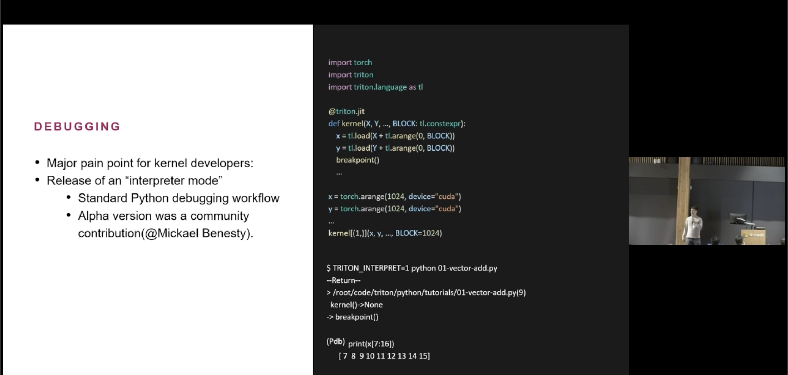

We’re happy to share some news from earlier this year: in May 2023, at OpenAI’s request, we upstreamed a piece of Kernl to the Triton project — a Triton “debugger” that lets you run a Triton kernel like regular Python.

Instead of compiling your kernel, the debugger pretends to be `triton.language` while your code runs and executes the ops with PyTorch on CUDA. That means you can check your logic—indexes, masks, shapes, and reads/writes—without touching the compiler.

<!-- more -->

Think of it as a dress‑up act: your kernel still calls `tl.arange`, `tl.load`, `tl.store`, and friends, but under the hood those calls are handled by a Torch‑based stand‑in. When you pass tensors into the kernel, the debugger keeps track of their storage. When your code does pointer math like `x_ptr + offsets` and then loads or stores, the debugger turns that into reads and writes at the right places in the original tensors. It also walks the launch grid for you: it sets the current “program” (block) and runs your kernel body once per block, just like Triton.

Using it is simple: keep your kernel code the same and swap decorators. Change `@triton.jit` to `@triton_debug`, and if you use autotune, change `@triton.autotune(...)` to `@triton_debug_autotune(...)`. Keep your usual `grid(meta)` function. Now you can call the kernel from Python on small CUDA tensors, compare the result to a PyTorch reference, and fix off‑by‑one or masking mistakes quickly. When the logic looks good, switch back to `@triton.jit` to compile and tune for speed.

What it’s good for: learning the mental model (how offsets and masks drive memory access), fast iteration on indexing and shape code, and unit tests (call the kernel like a normal function and assert against a Torch result). It also works when tensors aren’t contiguous, because it operates at the storage level.

What it isn’t: a profiler. There’s no compilation or timing here—use it for correctness, not performance numbers. Some Triton‑specific features aren’t implemented (e.g., atomics and a few intrinsics), and because we’re using PyTorch ops, edge‑case numerics can differ slightly from a compiled Triton kernel. If you hit something unsupported, the debugger will say so.

That’s it: swap the decorators, run on small inputs, compare to Torch, fix the logic, then compile.

Slide from the Philippe Tillet presentation during the first Triton conference referencing the release of an “interpreter mode” and noting the alpha version as a community contribution.

Thanks to the Triton team for the collaboration and for making this flow available to more kernel authors.
